# Hi there, I'm Stephanie! 👋 
### Graphic Designer | Full-Stack Coding Student | AI Enthusiast

  

---

## 💫 About Me
* 🎓 **Graphic Design Graduate** transitioning into Web & Mobile Development.
* 🤖 **AI Enthusiast** exploring how to merge creativity with automation.
* ⚡ **Goal:** Building reliable income through digital pursuits and creative tech.
* 🏠 Based in a small town, preparing for a city internship in 2027.
* 🔮 Interests: Spirituality, health, and biophilic design.

### 🛠 Tech Stack

  
  
  
  

## 📊 My Coding Activity

  
  

## 🐍 My Contribution Snake

  

## 🚀 Featured Projects
- **[Vibrant Impact Poster Generator](./vibrant-impact-poster-generator)**: A tool merging design and code.
- **[Cloudgarden Interiors](./Cloudgarden_Interiors)**: Exploring biophilic design in web layouts.
- **[Custom Music](./custom-music)**: Creative assets built for inspiration and connection.
